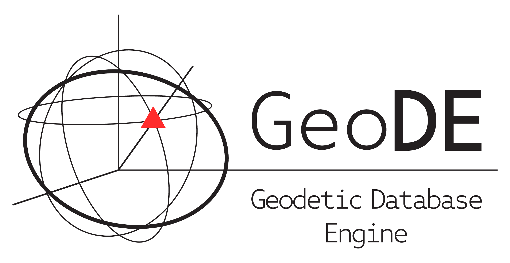

# GeoDE (Geodesy Database Engine)

A comprehensive Python framework for automated GNSS data processing, analysis, and management. GeoDE integrates multiple geodetic software packages (GAMIT/GLOBK, GPSPACE, and soon M-PAGES) with PostgreSQL database management and web-based visualization tools.

## Overview

**GeoDE (Geodesy Database Engine)** provides a complete solution for processing and managing large-scale GNSS datasets for geodetic applications. Originally developed by [Demian Gomez](https://github.com/demiangomez) and contributors, GeoDE handles the entire workflow from raw data ingestion to time series analysis, offering parallelized processing capabilities, robust metadata tracking, and comprehensive quality control tools.

### Key Features

- 🚀 **Parallel Processing** - Distribute geodetic processing jobs across multiple compute nodes for maximum throughput
- 🗄️ **PostgreSQL Integration** - Centralized storage and management of RINEX data, station metadata, and processing results
- 🌐 **GeoDE Desktop Web Interface** - Interactive map-based visualization for monitoring station networks and managing metadata
- 📊 **Time Series Analysis** - Built-in tools for plotting and analyzing position time series with ETM (Extended Trajectory Model) fitting
- 🔍 **Quality Control** - Automated detection of metadata inconsistencies and data gaps
- 📡 **Multi-Format Support** - Handle RINEX 2/3, Hatanaka compression, and various coordinate systems
- 🔧 **Multi-Software Integration** - Seamlessly process data using GAMIT/GLOBK, GPSPACE, and M-PAGES (NGS)

## Architecture

GeoDE consists of two main components:

1. **Command Line Interface (CLI)** - Core processing engine for parallel GNSS analysis
2. **Web Interface** - Django-based frontend for station monitoring and metadata management

## Installation

### Prerequisites

Ensure the following dependencies are installed and available in your PATH:

- **GAMIT/GLOBK** - http://www-gpsg.mit.edu/gg/
- **GFZRNX** - https://gnss.gfz-potsdam.de/services/gfzrnx
- **rnx2crx/crx2rnx** - https://terras.gsi.go.jp/ja/crx2rnx.html
- **GPSPACE** - https://github.com/demiangomez/GPSPACE
- **PostgreSQL** (server)
- **Python 3.10**

### Database Setup

1. Deploy the database skeleton using `database/gnss_data_dump.sql`
2. Configure required tables using the provided CSV files:
   - `keys.csv` - System configuration keys
   - `rinex_tank_struct.csv` - RINEX file storage structure
   - `receivers.csv` & `antennas.csv` - IGS equipment codes
   - `gamit_htc.csv` - Antenna height/offset calibrations

### CLI Installation

```bash
pip install geode-gnss
```

Create a working directory and configure `gnss_data.cfg` with your database connection, archive paths, and compute nodes. See [Installation.md](Installation.md) for detailed configuration options.

## Core CLI Tools

### Data Management
- **`ArchiveService.py`** - Service for managing archive operations and locks
- **`DownloadSources.py`** - Automated RINEX data retrieval from external sources
- **`ScanArchive.py`** - Archive scanning, station info insertion, and PPP processing

### Analysis & Visualization
- **`PlotETM.py`** - Time series plotting with trajectory model fitting
- **`AlterETM.py`** - Modify ETM parameters (polynomial terms, jumps, periodic signals)

### Station Selection Syntax

All CLI tools support flexible station selection:

```bash
# Single station
PlotETM.py igs.pwro

# Multiple stations
PlotETM.py igs.pwro igs.onsa

# All stations in a network
PlotETM.py igs.all

# Country code (ISO 3166)
PlotETM.py ARG

# Wildcards (regex style)
PlotETM.py ars.at1[3-5]  # at13, at14, at15
PlotETM.py ars.at%       # all stations starting with 'at'

# Exclusions
PlotETM.py igs.all *igs.pwro  # all IGS stations except pwro

# Selection by type (requires GeoDE Studio tables api_stationtype and api_stationmeta)
PlotETM.py ARG:CONTINUOUS  # Continuous stations in Argentina
PlotETM.py CHL:CAMPAIGN    # Campaign stations in Chile
PlotETM.py USA:CORS        # CORS stations in USA
PlotETM.py all:CONTINUOUS  # All CONTINUOUS stations

# Geographic region selection
PlotETM.py ARG:LAT[-35,-40]            # All stations in ARG within LAT range
PlotETM.py ARG:BBOX[-30,-40,-70,-60]   # Bounding box in Argentina
PlotETM.py ARG:PLATE[SC]               # Argentina stations in the Scotia plate
PlotETM.py ARG:RADIUS[-35.5,-65.2,500] # 500 km radius around point

# Combined filters
PlotETM.py ARG:CAMPAIGN:RADIUS[-35.5,-65.2,500] # 500 km radius around point, only campaign sites
```

## Web Interface

The web interface provides:

- 🗺️ **Interactive Map** - OpenStreetMap-based visualization with station status indicators
- 📋 **Station Details** - Equipment history, coordinates, photos, and site visit logs
- 📁 **RINEX Management** - File browser with metadata validation and gap detection
- ⚙️ **Metadata Editor** - Web-based forms for updating station information
- 🔍 **Search & Filters** - Query stations by code, network, country, or date range

### Key Indicators

- 🟢 **Green markers** - Stations with complete, validated metadata
- 🔴 **Red markers** - Stations requiring attention (missing metadata or errors)
- ⚠️ **Warning icons** - RINEX files with metadata inconsistencies

See [WebInterface.md](WebInterface.md) for detailed interface documentation.

## Example Workflows

### Process new RINEX data
```bash
# Download and scan for new files
DownloadSources.py igs.all -win 7

# Run PPP solutions
ScanArchive.py igs.all -ppp

# Plot time series
PlotETM.py igs.pwro -gui
```

### Add earthquake jump to trajectory model
```bash
AlterETM.py igs.pwro -fun j + 1 2024/02/15 30,60
```

## Documentation

- [Installation Guide](INSTALL.md) - Detailed setup instructions
- [Web Interface Guide](WebInterface.md) - Complete UI documentation
- [CLI Reference](CLIinterface.md) - Command-line tool usage

## Citation

If you use GeoDE in your research, please cite:

> Gomez, D.D., et al. (2024). GeoDE: Geodesy Database Engine for automated GNSS processing and analysis. *GitHub repository*. https://github.com/demiangomez/geode

## License

BSD 3-Clause License

## Support

For questions, issues, or contributions, please open an issue on the [GitHub repository](https://github.com/demiangomez/Parallel.GAMIT).
